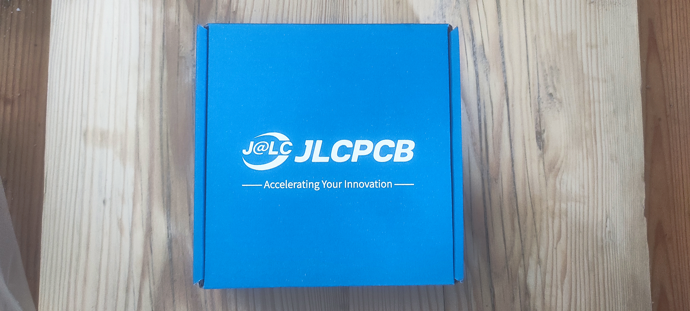
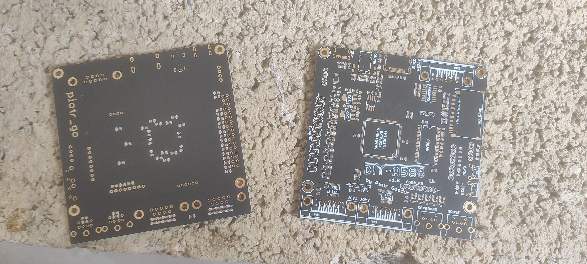

# Intro

Welcome to the build log for DIY-A586-v1.9, a project by piotr_go. This repository serves as a journal of DIY-A586-v1.9 build. Please note that the information provided here is based on the project's current state and may be subject to updates and improvements.

It is important to understand that the information and instructions provided in this document are intended for my own reference only. As of the time of writing, the build has not been completed, which means that the accuracy and correctness of the information cannot be guaranteed. Therefore, it is crucial to exercise caution if you decide to use information provided here in your own build.

This will be my first SMD soldering project. I take no responsibility for any of the information provided. Use at your own risk!

Latest version of my build log can always be found here: [https://github.com/sillyc0n/diy-a586-v1.9-soldering](https://github.com/sillyc0n/diy-a586-v1.9-soldering)

# Purpose

As I find myself in my forties, reminiscing about the charm of retro computing, one machine that continues to captivate my imagination is the Amiga. The Amiga holds a special place in the hearts of enthusiasts like me.

With a collection of old-school machines already in my possession, it feels like the perfect time to add an Amiga to my ensemble. However, this endeavor is about more than just acquiring another machine. It serves as a crucial stepping stone towards my ultimate goal—owning a real Amiga.

To accomplish this, I have chosen to embark on this project, building FPGA Amiga from scratch and teaching myself SMD soldering for the first time. An important step, before I attempt to build a truly real Amiga I need to get needed skills and confidence. 

And what better way to make the journey even more meaningful than involving my children in the process? By doing so, I hope to instill in them a passion for electronics and provide an invaluable hands-on learning experience.  As we solder each component together, my children will discover the magic of circuitry. It's about the journey of building something together and the lasting memories we'll create along the way.

Moreover, this DIY project serves as a gateway, reintroducing me to the world of Amiga computing in 2023. It allows me to reacquaint myself with the beloved machine and immerse myself in the vibrant Amiga community, where like-minded enthusiasts come together to appreciate its unique capabilities and artistic potential.

This shall serve as a testament to my dedication, determination, and unwavering passion for the retro computing era.

So, let us embark on this exhilarating journey together, using this project as yet another adventure in our lives.

# License

I hold no rights to the DIY-A584 board design. Therefore, always check and adhere to [DIY-A586 by Piotr Gozdur <piotr_go>](https://github.com/piotr-go/DIY-A586/tree/master#diy-a586-by-piotr-gozdur-piotr_go) for license information.

# Important links

You will find more information on [https://www.elektroda.pl/rtvforum/topic3891155-30.html](https://www.elektroda.pl/rtvforum/topic3891155-30.html).

# Build

## PCBs (2023-06-21):
I used piotr_go's gerber files from [https://github.com/piotr-go/DIY-A586/blob/master/v1.9/pcb/v1.9/gerbers.tar.gz](https://github.com/piotr-go/DIY-A586/blob/master/v1.9/pcb/v1.9/gerbers.tar.gz) as a source. Repacked as a zip and ordered boards from JLCPCB.

Following parameters were used:

- Layers: 2
- Dimension: 100 mm * 100 mm
- Product Type: Industrial/Consumer electronics
- Different Design: 1
- Delivery Format: Single PCB
- PCB Thickness: 1.6
- Impedance Control: no
- PCB Color: Black
- Silkscreen: White
- Via Covering: Tented
- Surface Finish: ENIG
- Gold Thickness: 1 U"
- Deburring/Edge rounding: No
- Outer Copper Weight: 1 oz
- Gold Fingers: No
- Flying Probe Test: Fully Test
- Castellated Holes: no
- Remove Order Number: No
- 4-Wire Kelvin Test: No
- Paper between PCBs: No
- Appearance Quality: IPC Class 2 Standard
- Confirm Production file: No
- Silkscreen Technology: Ink-jet/Screen Printing Silkscreen
- Package Box: With JLCPCB logo
- Board Outline Tolerance: ±0.2mm (Regular)

1. Why ENIG for a prototype boards designs: 
- because it was not much more expensive than a regular board

## Parts ordered (2023-06-24)
To acquire all the necessary components for the DIY-A586-v1.9 board, I made the following purchases:

1. **Bulk Order from LCSC:**
    - I placed a bulk order from LCSC, a reliable electronics components supplier, to obtain the majority of the required parts. I exported BOM file from LCSC to [LCSC_Exported__20230624_151154.csv](bom/LCSC_Exported__20230709_234719.csv). This file contains most of the components needed. As a precautionary measure I ordered additional components and BOM should allow to assemble 3 boards. 

2. **1N4148 Diodes from eBay:**
    - I purchased the 1N4148 diodes from eBay using the following link: [https://www.ebay.co.uk/itm/115574778107](https://www.ebay.co.uk/itm/115574778107).

3. **PS2 Ports from AliExpress:**
    - To acquire the necessary PS2 ports, I placed an order through AliExpress using the provided link: [https://www.aliexpress.com/item/1005005368783447.html](https://www.aliexpress.com/item/1005005368783447.html) for **L 6Pin Straight Feet** and **K 6Pin Green**

4. **Tactile Switches from AliExpress:**
    - Lastly, I obtained the required tactile switches by making a purchase from AliExpress. I followed the link: [https://www.aliexpress.com/item/1005005274168459.html](https://www.aliexpress.com/item/1005005274168459.html) for **Type 3, 6x6x5mm switches**.
    
## Soldering equipment (2023-06-24)

To ensure a smooth soldering process, it is recommended to have the following tools and materials readily available:

- **Soldering Iron:** An inexpensive soldering iron can (hopefully?) be used for the task. You can find suitable options at [https://www.aliexpress.com/item/1005005368783447.html](https://www.aliexpress.com/item/1005005368783447.html).

- **Soldering Tips:** It is advisable to have a variety of soldering tips and accessories on hand. I will be using [https://www.aliexpress.com/item/1005003390702660.html](https://www.aliexpress.com/item/1005003390702660.html).

- **Soldering Wire:** For optimal results, I will use **WELLER Solder ROSIN CORE FLEX Wire WSWSACLO Sn3.0AG05CU 0.5mm 50gr LeadFree RoHS**.

- **PCB Circuit Board Holder:** To simplify the soldering process and ensure stability, I will utilise a PCB circuit board holder from [https://www.ebay.co.uk/itm/155581423064](https://www.ebay.co.uk/itm/155581423064).

- **Flux:** Soldering wire has flux core, so hopefully additional flux will not be needed but if required I will be using RELIFE RL-422 and Topnik TK-83.

## Parts
The BOM needs to be updated.
1. I know for sure I ordered wrong floppy power headers, they are too big. Thus LCSC part numer C5453989 was removed from BOM.

## PCBs (2023-07-06)

Soon after ordering I received these wonderful PCBs in matte black with ENIG surface finish.





## Building the thing 

### Soldering first attempt (2023-07-09)

I received my parts yesterday and was thrilled to begin soldering. I made the decision to start with the smallest components first, as successfully soldering them would make everything else much easier.

After a few attempts with PUSB3FR4Z, I realized that I couldn't achieve a proper solder without a heat gun. Also the PCB got bastardized a bit in the process - at least they are not super expensive. Interestingly even though the piece is not exactly centered, multimeter test shows diodes between proper pins, so that's a plus.

This setback will slow me down, but I am optimistic that the end result will be improved. They say that there are no failures, only feedback. The feedback so far is that I'm not very skilled at soldering tiny pieces and my hands are actually quite steady.


### Soldering second attempt (2023-07-30)

Meanwhile, I got my hot air gun, an Atten ST-862D from China, as recommended by many people. You cannot go wrong with it. I just haven't received soldering paste, and I was not really planning to get back into soldering without this important component. But here we go, I got it right this time. Having a good day, I decided to put a second ESD protector as well. I hope these were the two most difficult parts to get.

The multimeter test passed, so next time I should be getting some more elements placed. It is the same PCB as before, just a different light and angle. It does not look bad apart from the exposed traces, but we will fix them later.

I must say using the hot air gun is probably more difficult than the iron, so the actual soldering was done with a very fine tip attached to the soldering iron, and I used my Atten just to remove the element for repositioning. Somehow the hot air gun just heats up the flux but never gets the tin. I will learn it someday.


### Programming flash (2023-07-31)

Having all the equipment handy is important. Luckily, I have a ROM programmer because while I was hacking my PC BIOS before, I managed to break it once or twice, and I had to reprogram it.


Connect it and get it ready. Read the flash first to confirm the actual size.
```
sudo flashrom --programmer ch341a_spi -r ~/Downloads/empty.bin
Password:
flashrom v1.3.0 on Darwin 21.3.0 (x86_64)
flashrom is free software, get the source code at https://flashrom.org

Calibrating delay loop... OK.
libusb: info [darwin_detach_kernel_driver] no capture entitlements. may not be able to detach the kernel driver for this device
libusb: info [darwin_claim_interface] no interface found; setting configuration: 1
Found Winbond flash chip "W25Q128.V" (16384 kB, SPI) on ch341a_spi.
===
This flash part has status UNTESTED for operations: WP
The test status of this chip may have been updated in the latest development
version of flashrom. If you are running the latest development version,
please email a report to flashrom@flashrom.org if any of the above operations
work correctly for you with this flash chip. Please include the flashrom log
file for all operations you tested (see the man page for details), and mention
which mainboard or programmer you tested in the subject line.
Thanks for your help!
Reading flash...
```


This only takes few minutes.
```
Reading flash... done.
```

Yes, it's 16MB.
```
ls -l ~/Downloads/empty.bin
-rw-r--r--@ 1 root  staff  16777216 31 Jul 07:58 /Users/sillyc0n/Downloads/empty.bin

ls -lh ~/Downloads/empty.bin
-rw-r--r--@ 1 root  staff    16M 31 Jul 07:58 /Users/sillyc0n/Downloads/empty.bin
```

```
cp ~/Downloads/empty.bin final.bin
```

```
tar zxvf ~/workspace/DIY-A586/v1.9/main/MAIN\ v0.4.4b.tar.gz
```

There are 2 files:
```
main.bin main.d19
```

I do not know what main.d19 is for, so for now, let's follow the instructions and work with main.bin. Let's adjust the binary file to the correct size.
```
dd if=main.bin of=final.bin conv=notrunc
672+0 records in
672+0 records out
344064 bytes transferred in 0.002744 secs (125389609 bytes/sec)
```

Write the ROM:
```
sudo flashrom --programmer ch341a_spi -w final.bin
Password:
flashrom v1.3.0 on Darwin 21.3.0 (x86_64)
flashrom is free software, get the source code at https://flashrom.org

Calibrating delay loop... OK.
libusb: info [darwin_detach_kernel_driver] no capture entitlements. may not be able to detach the kernel driver for this device
Found Winbond flash chip "W25Q128.V" (16384 kB, SPI) on ch341a_spi.
===
This flash part has status UNTESTED for operations: WP
The test status of this chip may have been updated in the latest development
version of flashrom. If you are running the latest development version,
please email a report to flashrom@flashrom.org if any of the above operations
work correctly for you with this flash chip. Please include the flashrom log
file for all operations you tested (see the man page for details), and mention
which mainboard or programmer you tested in the subject line.
Thanks for your help!
Reading old flash chip contents... done.
Erasing and writing flash chip... Erase/write done.
Verifying flash... VERIFIED.
libusb: warning [darwin_open] USBDeviceOpen: another process has device opened for exclusive access
```

Verify the ROM. It was verified on write but does not hurt to do it again.
```
sudo flashrom --programmer ch341a_spi -v final.bin
Password:
flashrom v1.3.0 on Darwin 21.3.0 (x86_64)
flashrom is free software, get the source code at https://flashrom.org

Calibrating delay loop... OK.
libusb: info [darwin_detach_kernel_driver] no capture entitlements. may not be able to detach the kernel driver for this device
libusb: info [darwin_claim_interface] no interface found; setting configuration: 1
Found Winbond flash chip "W25Q128.V" (16384 kB, SPI) on ch341a_spi.
===
This flash part has status UNTESTED for operations: WP
The test status of this chip may have been updated in the latest development
version of flashrom. If you are running the latest development version,
please email a report to flashrom@flashrom.org if any of the above operations
work correctly for you with this flash chip. Please include the flashrom log
file for all operations you tested (see the man page for details), and mention
which mainboard or programmer you tested in the subject line.
Thanks for your help!
Verifying flash... VERIFIED.
```

Since I bought more parts, enough to make three PCBs; let's program the other two flash roms, and we will be able to just solder them on later. 

And put them away safely. They will be needed for the next part.


That was the easy part. Looking forward to more soldering next time.

TBC

## Credits

Board designed by piotr_go. Thank you for answering my questions on Elektroda [DIY-A586 v1.9 by piotr_go](https://www.elektroda.pl/rtvforum/topic3891155-30.html).
